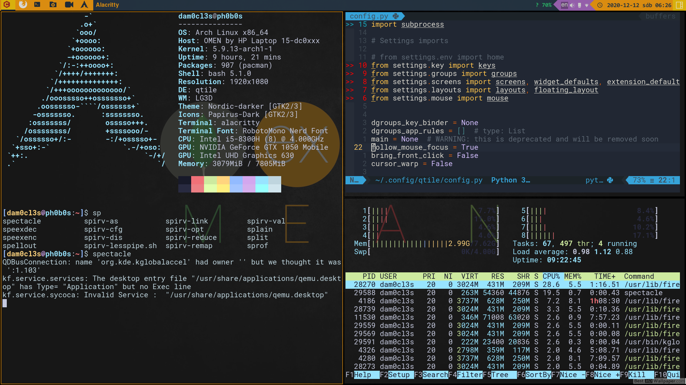

# Desktop configuration
## About
This is a desktop view and functional configuration, based con [Qtile](http://www.qtile.org), where you can find more about the personalitation. Also, this is a developmnet environment based on the [Neovim](https://neovim.io/).



### Table of contents

- [Clone this repository](#clone-this-repository)
- [Qtile configuration](#qtile-configuration)
  - [Installation](#installation)
  - [Configuration](#configuration)
  - [Functionalities](#functionalities)
  - [All packages list](#list-packages)
	- [Fonts](#qtile-fonts)
	- [Dependences](#qtile-dependences)

- [Alacritty configuration](#alacritty-configuration)
	- [Installation](#installation)
- [Neovim configuration](#neovim-configuration)

## Clone this repository
```bash
git clone https://github.com/damocles217/desktop_config.git
```

## Qtile configuration
### Installation

Arch Linux installation:
```bash
pacman -S qtile lightdm
pacman -S lightdm-gtk-greeter
```
Ubuntu/Debian installation:
```bash
sudo apt-get install qtile
```
Fedora installation
```bash
dnf -y install qtile
```
Basicly, for all distributions is the same package.

In the case you can't find, others installation:

```bash
git clone git://github.com/qtile/qtile.git
cd qtile
pip install .
```
You can find more on: [Qtile Installation](http://docs.qtile.org/en/latest/manual/install/index.html)

The packages ***qtile and lightdm*** are respectively the Window Manager (WM) and the Login Manager (LM).
The package ***lightdm-gtk-greeter*** is the basic configuration of lighdtm, **necesary** for a successfull desktop loading.
### Configuration

```bash
systemctl enable lightdm
systemctl start lightdm
```
This is the Login Manager initiallitation, to Qtile can be initiallizated.

Copy my configuration:
```bash
#From the my git repository, copy:
cp -rf ./.config/qtile ~/.config
```
## Alacritty configuration
### Installation

## Neovim configuration
### Installation
For 
